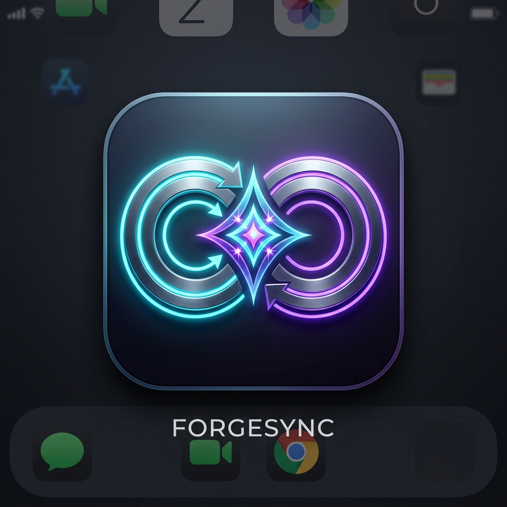

# ForgeSync

**ForgeSync** is a powerful desktop application that intelligently merges AI code generation with robust GitHub branch synchronization. It bridges the gap between conversational AI and local code management, allowing developers to safely evaluate, merge, and commit AI modifications directly into their local repository trees via visual diff views.



## ⚡ Features
* **AI Branch Merging:** Use Google's Gemini models to handle complex Git conflicts intelligently. 
* **Streaming AI Diffs:** Watch your code get synthesized in an interactive, side-by-side diff overlay before committing anything locally.
* **Smart GitHub Synchronization:** Pull remote files quickly with multi-threaded downloading and safely overwrite local scopes while explicitly preserving binary files (image data).
* **Multi-Tool Suite:** Includes an AI-powered mass file extension renamer, folder comparator, and an intelligent resizing matrix for generating image variants optimized for social media or application bundles.
* **Offline-Ready:** Your project configuration isn't locked down inside cloud databases; your local `forgesync_settings.json` serves exclusively as the single source of truth alongside hardened system keyring bindings for API credentials. 

## 🛠️ Installation

**Running the Source**

ForgeSync relies on `customtkinter` for its dark-mode-first aesthetic and `PyGithub`/`google-genai` for infrastructure parsing.

1. Clone the repository
   ```sh
   git clone https://github.com/yourusername/ForgeSync.git
   cd ForgeSync
   ```

2. Install the necessary Python packages
   ```sh
   pip install -r requirements.txt
   ```

3. Launch the App
   ```sh
   python main.py
   ```
*(Alternatively, simply run the compiled `.exe` executable available in the Releases tab.)*

## 🔑 Getting Started (Settings)
When you first open ForgeSync, navigate to the **⚙️ Settings** tab.
1. Enter your **Google Gemini API Key**.
2. Enter your **GitHub Personal Access Token** (This token requires remote repository viewing/branch creation permissions).
3. Select your preferred Gemini AI Model.

Everything is securely managed safely through your operating system's native OS credential keyring via Python's `keyring` package. 

## 🛠️ Technology Stack
* **UI/UX:** CustomTkinter + Pygments
* **AI:** Google GenAI SDK (Gemini Flash & Pro Contexts)
* **API Hooks:** PyGithub
* **Concurrency:** Native `threading` mixed with decoupled Task Pools

---